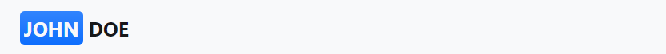

## Frameworks
[Bootstrap](https://getbootstrap.com/) is the most famous CSS framework, but there are many others that have a different design or design approach. Other notable examples of CSS frameworks include [Materialize CSS](https://materializecss.com/), [Foundation](https://get.foundation/), [Bulma](https://bulma.io/), and [Tailwind CSS](https://tailwindcss.com/).

### In sum:
- **Accessing websites via mobile phones is a growing trend** that you should consider as a web developer.
- It is **recommended to create responsive layouts for your websites** and web applications.
- External libraries such as **Bootstrap will help you build user interfaces** that provide a **responsive** user experience.

## Include Bootstrap to your project
All you need to get started with Bootstrap 5 is a link to a minified CSS file in `<head>` section:
```css
<link href="https://cdn.jsdelivr.net/npm/bootstrap@5.1.3/dist/css/bootstrap.min.css" rel="stylesheet">
```
It must be added before other CSS files so that your styles override Bootstrap's default styles.

Many of Bootstrap components require the use of JavaScript to function. Specifically, they require our own JavaScript plugins and Popper. Add this line of code at the bottom of the page just before the closing `</body>` tag:
```html
<script src="https://cdn.jsdelivr.net/npm/bootstrap@5.1.3/dist/js/bootstrap.bundle.min.js"></script>
```

Starter template:
```html
<!doctype html>
<html lang="en">
  <head>
    <!-- Required meta tags -->
    <meta charset="utf-8">
    <meta name="viewport" content="width=device-width, initial-scale=1">
    <!-- Bootstrap CSS -->
    <link href="https://cdn.jsdelivr.net/npm/bootstrap@5.1.3/dist/css/bootstrap.min.css" rel="stylesheet">
    <title>Hello, world!</title>
  </head>
  <body>
    <h1>Hello, world!</h1>
    <!-- Optional JavaScript; -->
    <script src="https://cdn.jsdelivr.net/npm/bootstrap@5.1.3/dist/js/bootstrap.bundle.min.js"></script>
  </body>
</html>
```

[Instructions](https://getbootstrap.com/docs/5.1/getting-started/introduction/)

[BootstrapCDN](https://www.bootstrapcdn.com/)

## Analyze structure of page
- Before you start integrating a model (from Figma or etc), you should always take the time to parse it (at least mentally) to get the overall structure.
- The overall structure of a page often consists of various sections (menu, header, content, footer, etc.) divided into parts in a container.
- Always find time to read the [documentation](https://getbootstrap.com/docs/5.1/getting-started/introduction/) for the new tool before you start using it.

## Implement page' structure
Main Bootstrap element - `container`. Allow to center content horizontally and add horizontal `margin`s.
```html
<div class="container">
  <!-- Content -->
</div>
```
If need screen `width: 100%`, use instead - `container-fluid`.

Starting with Bootstrap 5 there are new containers: `.container-{breakpoint}` (example: `.container-lg`). They allow you to adapt your "container" to the size of the user's screen. [Source](https://getbootstrap.com/docs/5.0/layout/containers/)

### Grid
Bootstrap use 12 columns grid system with `row` and `col` classes. 
```html
<div class="container">
  <div class="row">
    <div class="col">Première colonne</div>  <!-- by default bootstrap set this element 50% width of screen (aka 6 columns) -->
    <div class="col">Deuxième colonne</div>
  </div>
</div>
```
Explicit column width with `col` postfixes: from `-1` to `-12`):
```html
<div class="col-8">Première colonne</div>
```
Helping classes:
- `.bg-light` : background color of element
- `.m-5` : margin 5
- `.border-top` : border
- [etc](https://getbootstrap.com/docs/5.1/utilities/api/).

## Responsive
Remember that a **responsive page is a page that responds to different user screen sizes by changing the layout of the components**.

|Breakpoint|Class infix|Dimensions|
|-|-|-|
|X-Small|None|<576px|
|Small|`-sm-`|≥576px|
|Medium|`-md-`|≥768px|
|Large|`-lg-`|≥992px|
|Extra large|`-xl-`|≥1200px|
|Extra extra large|`-xxl-`|≥1400px|

Example class: `col-md-6`.

Space between cols and rows called **gutter**. Set up with classes `.g-{0-5}`. Default value `.g-4`. [man page](https://getbootstrap.com/docs/5.1/layout/gutters/)

**Empty cols** set up by `.offset-{0-11}`.  Moves the column to which it was added to the right.
```html
<div class="row">
  <div class="col-md-4">.col-md-4</div>
  <div class="col-md-2 offset-md-4">.col-md-2 .offset-md-4</div>
</div>
<!-- result:
[[xxxx]    [xx]  ]
-->
```

## Personalization
### Fonts:
- bold text: `fw-bold` or `fw-{breakpoint}-bold`
- normal text: `fw-normal` or `fw-{breakpoint}-normal`
- [etc](https://getbootstrap.com/docs/5.1/utilities/text/#font-weight-and-italics).

`.{property}-{modificator}-{value}`

[man page](https://getbootstrap.com/docs/5.0/utilities/text/#font-size)

### Reading direction and alignment:
`.text-start` or `text-{breakpoint}-start` for left alignment and `.text-end` for right. 

[man pages](https://getbootstrap.com/docs/5.0/utilities/text/#text-alignment)

### Buttons:
Use `<button>` or `<a class="btn">`

Style classes for colors and etc: `btn-primary`, etc.

[man pages](https://getbootstrap.com/docs/5.0/components/buttons/)

### Icons:
```html
<link rel="stylesheet" href="https://cdn.jsdelivr.net/npm/bootstrap-icons@1.5.0/font/bootstrap-icons.css">
```
```html
<a href="#linkedin" target="_blank">
    <i class="bi bi-linkedin"></i>
</a>
```
[man pages](https://icons.getbootstrap.com/)

### Navigation:
```html
<nav class="navbar"></nav>
```

The `.navbar-expand` class affects the width of the viewport for which the navigation bar is expanded or collapsed. You can adapt the navigation bar breakpoint with a class modifier { `-sm , -md , -lg , -xl, -xxl` } added to the `.navbar-expand` class like so: `.navbar-expand-md`.
```html
<nav class="navbar navbar-expand"></nav>
```

For branding use:
```html
<nav class="navbar navbar-expand">
    <a class="navbar-brand" href="...">Prénom Nom</a>
</nav>
```
```html
<nav class="navbar navbar-expand">
  <a class="navbar-brand text-uppercase fw-bold" href="index.html">
    <span class="bg-primary bg-gradient p-1 rounded-3 text-light">John</span> Doe
  </a>
</nav>
```


Class `.fixed-top` for pin navigation to top while scrolling.

#### Adaptive navigation:
- `1.` Use class `navbar-expand-md` for `<nav>`.
- `2.` **Add a navigation toggle button** with `.navbar-toggler` that will show or hide your website's navigation menu. For responsive navigation, insert a button immediately after the element of class `.navbar-brand` with the following attributes and content:
```html
<button class="navbar-toggler"
        type="button"
        data-bs-toggle="collapse"    <!-- use for .collapse and .navbar-collapse bottom-->
        data-bs-target="#navbarNav"  <!-- use as id in <div> bottom-->
        aria-controls="navbarNav"
        aria-expanded="false"
        aria-label="Toggle navigation">
    <span class="navbar-toggler-icon"></span>
</button>
```
- `3.` Wrap navigation list with `<div>` and `.navbar-collapse`.
```html
<div class="collapse navbar-collapse justify-content-end" id="navbarNav">
    <ul class="navbar-nav">
        <li class="nav-item">
            <a class="nav-link" href="#johndoe">Qui suis-je ?</a>
        </li>
        <li class="nav-item">
            <a class="nav-link" href="#expertise">Expertises</a>
        </li>
    </ul>
</div>
```

[man page](https://getbootstrap.com/docs/5.1/components/navbar/#responsive-behaviors)

### Progress bar:

[man pages](https://getbootstrap.com/docs/5.0/components/progress/)

```html
<div class="progress">
    <div class="progress-bar" role="progressbar" style="width: 25%" aria-valuenow="25" aria-valuemin="0" aria-valuemax="100"></div>
</div>
```

### Card:

[man pages](https://getbootstrap.com/docs/5.0/components/card/)

Card structure:
```html
<div class="card">
    
    <div class="card-body">
        <h5 class="card-title">Card title</h5>
        <p class="card-text">Some quick example text to build on the card title and make up the bulk of the card's content.</p>
        <a href="#" class="btn btn-primary">Go somewhere</a>
    </div>
</div>
```